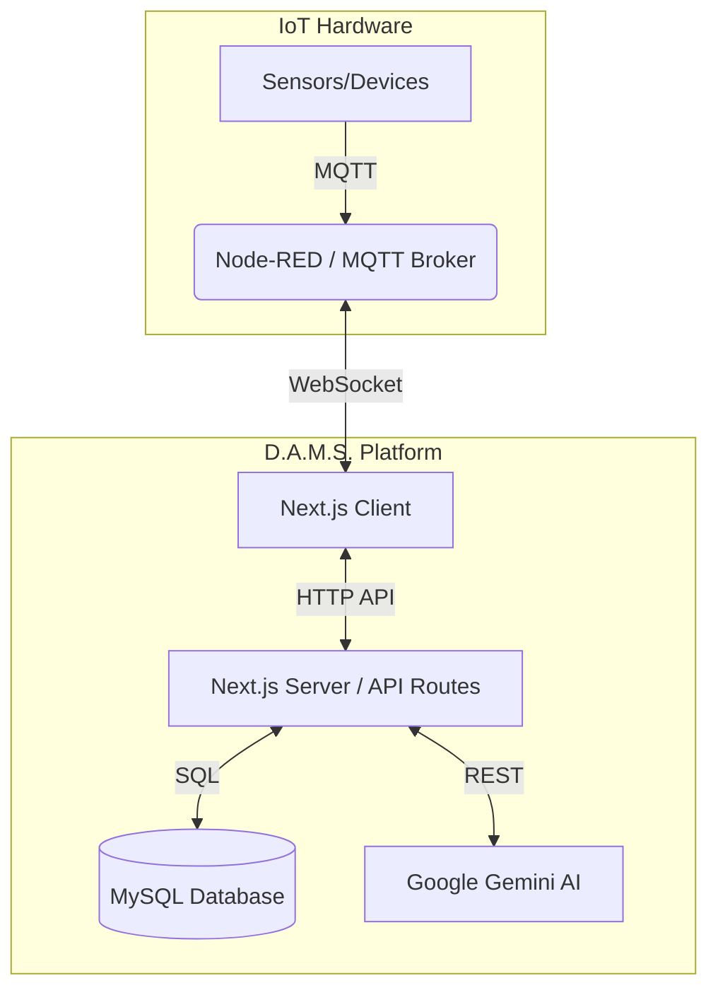

<div align="center">
  <h1>🔬 D.A.M.S.</h1>
  <p><strong>Data Acquisition & Monitoring System</strong></p>
  <p><em>A full-stack, AI-powered platform for real-time IoT laboratory telemetry, analysis, and control.</em></p>

  [](https://nextjs.org/)
  [](https://www.typescriptlang.org/)
  [](https://tailwindcss.com/)
  [](https://www.mysql.com/)
  [](https://ai.google.dev/)
</div>

<br />

## 📑 Table of Contents
- [Overview](#-overview)
- [Key Features](#-key-features)
- [Technology Stack](#-technology-stack)
- [System Architecture](#-system-architecture)
- [Getting Started](#-getting-started)
- [Environment Configuration](#-environment-configuration)
- [API Reference](#-api-reference)
- [WebSocket Protocol](#-websocket-protocol)
- [Default Credentials](#-default-credentials)

---

## 🌟 Overview
**D.A.M.S.** (Data Acquisition & Monitoring System) is a comprehensive research laboratory interface tailored for the **ISTC Smart Lab**. It empowers researchers and administrators to seamlessly manage IoT experiments, stream live telemetry data via WebSocket/MQTT, remotely control connected hardware, and leverage state-of-the-art AI (Google Gemini) for automated analysis and lab report generation.

---

## ✨ Key Features

### 🧪 Experiment Management
- **Lifecycle Control**: Create, view, list, and delete experiments.
- **Visibility**: Fine-grained access control with Public and Private experiment visibility.

### 📡 Real-Time Telemetry & Control
- **Live Streaming**: Low-latency WebSocket data ingestion for continuous metric tracking.
- **Bi-directional Control**: Issue start/stop commands and custom instructions to devices.
- **Dynamic Dashboards**: Visualize data with 6 diverse ECharts (Line, Gauge, Dial, Bar, Area, Scatter).

### 🤖 AI-Powered Intelligence
- **Interactive Assistant**: Context-aware chat powered by Gemini 1.5 Flash. Generates device boilerplate code (e.g., Wi-Fi & MQTT).
- **Automated Insights**: One-click holistic summaries of experiment parameters.
- **Report Generation**: Upload CSV datasets to generate 2-3 page comprehensive lab reports using Gemini 2.5 Flash, downloadable as PDFs.

### 🛡️ Security & Administration
- **Robust Authentication**: JWT (HS256) session management with `jose` and `bcrypt` password hashing.
- **Role-Based Access**: Middleware-enforced route protection and admin-exclusive endpoints.
- **Bulk Operations**: Admins can bulk-import users via `.xlsx` or `.csv` files.

---

## 🛠️ Technology Stack

| Category | Technologies |
|:---|:---|
| **Frontend & Core** | Next.js 16 (App Router), React 19, TypeScript |
| **Styling & UI** | Tailwind CSS 4, Framer Motion, Lucide React |
| **Database & Auth** | MySQL (`mysql2`), `jose` (JWT), `bcryptjs` |
| **AI & ML** | Google Gemini API (1.5 Flash, 2.5 Flash) |
| **Data Visualization** | Apache ECharts (`echarts-for-react`) |
| **Data Processing** | SheetJS (`xlsx`), `html2pdf.js`, `react-markdown` |

---

## 🏗️ System Architecture



### 🔐 Authentication Flow
- **Login**: Verifies credentials, generates HS256 JWT, sets `httpOnly` cookie (`session`).
- **Middleware**: Intercepts requests, validates JWT, enforces role-based access (User vs. Admin).

---

## 🚀 Getting Started

### 1. Prerequisites
- **Node.js**: v18 or newer
- **Database**: MySQL 5.7+ or 8.x
- **Services**: Google Gemini API Key, WebSocket/MQTT Broker (e.g., Node-RED)

### 2. Installation & Setup
Clone the repository and install dependencies:
```bash
git clone <repository-url>
cd istc-smart-lab
npm install
```

Initialize the database schema and seed data:
```bash
node seed.js
```

### 3. Running the Application
**Development Mode:**
```bash
npm run dev
```

**Production Mode (with PM2):**
```bash
npm run build
pm2 start ecosystem.config.js
```

---

## ⚙️ Environment Configuration

Ensure your `.env.local` file is populated with the following variables:

| Variable | Description |
|:---|:---|
| `DB_HOST` | MySQL server hostname |
| `DB_USER` | MySQL username |
| `DB_PASSWORD` | MySQL password |
| `DB_NAME` | MySQL database name |
| `SESSION_SECRET` | Secret key for JWT signing. **Must be secure.** |
| `GEMINI_API_KEY` | Google Gemini API key |
| `NEXT_PUBLIC_BASE_URL` | Base URL (e.g., `http://localhost:3000`) |
| `NEXT_PUBLIC_WS_HOST` | WebSocket server hostname |
| `NEXT_PUBLIC_WS_PORT` | WebSocket server port |
| `NEXT_PUBLIC_WS_PATH` | WebSocket path for telemetry stream |
| `NEXT_PUBLIC_WS_CONTROL_PATH` | WebSocket path for device commands |

---

## 🔌 API Reference

### 👤 Authentication (`/api/auth/*`)
- `POST /login`: Authenticate and issue JWT.
- `POST /logout`: Destroy session.
- `GET /session`: Retrieve current session status.
- `POST /signup`: *(Admin)* Provision new user.
- `POST /bulk-signup`: *(Admin)* Batch import users from spreadsheet.
- `POST /change-password`: Change authenticated user's password.
- `POST /reset-password`: *(Admin)* Reset user password to default.

### 🧪 Experiments (`/api/experiments/*`)
- `GET /`: List accessible experiments.
- `POST /`: Create a new experiment.
- `GET /[id]`: Retrieve experiment details.
- `DELETE /[id]`: *(Admin)* Delete experiment.

### 🧠 AI Services (`/api/ai*`)
- `POST /ai`: Generate quick experiment insights.
- `POST /ai-chat`: Context-aware conversational assistant.
- `POST /ai-report`: Generate full PDF lab report from CSV.

---

## 🔄 WebSocket Protocol

### Data Stream (`/mqtt-stream`)
Expects JSON payloads from connected devices:
```json
{
  "device": "esp32-alpha",
  "metric": "temperature",
  "value": 24.5,
  "passkey": "session-auth-key",
  "timestamp": "2026-05-03T12:00:00.000Z"
}
```

### Control Channel (`/control`)
Transmits JSON commands to devices:
```json
{
  "action": "command",
  "device": "esp32-alpha",
  "command": "start",
  "timestamp": "2026-05-03T12:00:00.000Z"
}
```

---

## 🔑 Default Credentials

> ⚠️ **SECURITY WARNING:** Change these credentials immediately upon deployment.

| Role | Email | Password |
|:---|:---|:---|
| **System Admin** | `admin@smartlab.com` | — |
| **Bulk-Import Default** | *(Per CSV/XLSX)* | `istc@12345` |
| **Reset Default** | *(Target User)* | `istc@12345` |

<br />

<div align="center">
  <p><em>Developed for the ISTC Smart Lab.</em></p>
</div>
